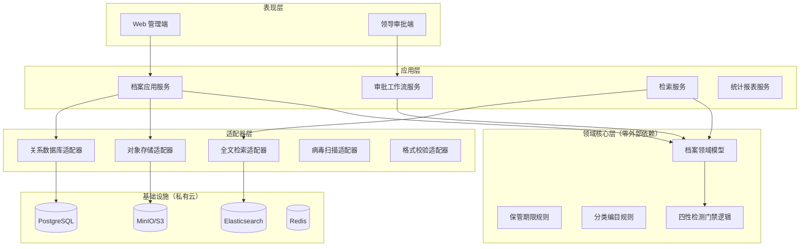

# Project Overview

## Preliminary Direction

设计并建设一套**城建建筑档案管理系统**，部署于**私有云**，服务集团多分公司场景，管理建设项目与单体建筑的全生命周期档案（纸质数字化、BIM、CAD 竣工图、电子竣工包），遵循 GB/T 50328-2019、DA/T 70-2018、DA/T 58-2014、DA/T 18-2022，不对接外部系统。

## Confirmed Task Definition (Phase 2)

| 维度 | 内容 |
|:-----|:-----|
| 部署形态 | 私有云（容器化/K8s 或 VM 集群） |
| 档案范围 | 纸质扫描、BIM 模型、CAD 图纸、电子竣工包 |
| 用户角色 | 集团管理员、分公司管理员、普通业务人员、公司领导（审批） |
| 合规标准 | GB/T 50328-2019、DA/T 70-2018、DA/T 58-2014、DA/T 18-2022 |
| 外部集成 | 无（GIS、政务、OA、SSO 均不对接） |
| AI 治理 | 必须定义 AI 禁止事项与人工确认门禁（见 `docs/contracts/governance/`） |
| 后端技术栈 | **Java 17 + Spring Boot 3**（已确认） |
| 销毁审批 | **分公司领导 + 分公司管理员**（无需集团管理员终审，已确认） |

## Target Architecture



**架构原则**：领域核心层只依赖契约（JSON Schema / 领域事件），不依赖具体数据库或存储实现（S.U.P.E.R P + U）。

## Technology Stack

| Layer | Target | Rationale |
|:------|:-------|:----------|
| Language (Backend) | **Java 17** | 已确认 |
| Framework | **Spring Boot 3** | 成熟生态、RBAC、事务支持 |
| Frontend | Vue 3 + TypeScript | 国内企业项目主流；表单著录场景友好 |
| API | REST + OpenAPI 3.1 | 契约驱动；`docs/contracts/api/openapi.yaml` 为唯一真相源 |
| Database | PostgreSQL 15+ | 多租户 row-level、JSONB 元数据、审计不可变可用触发器 |
| Object Storage | MinIO（S3 兼容） | 私有云大文件/BIM/CAD；路径契约见 `blob-layout.md` |
| Search | Elasticsearch 8 | 全文检索、聚合统计 |
| Cache/Queue | Redis | 会话、审批待办、异步检测任务 |
| Container | Docker + K8s / Docker Compose | 私有云标准部署 |
| Contract Format | JSON Schema Draft 2020-12 | 跨语言、可生成类型与契约测试 |

## Planned Module Boundaries

| Module | Responsibility |
|:-------|:---------------|
| `domain-core` | 档案实体、状态机、著录校验、保管期限计算（纯逻辑） |
| `integrity-check` | DA/T 70 四性检测编排与结果模型 |
| `ingest-service` | 上传、分片、病毒扫描、格式校验、入库门禁 |
| `archive-service` | 案卷/文件 CRUD（逻辑删除）、检索、导出 |
| `workflow-service` | 借阅、销毁、密级变更审批流 |
| `identity-service` | 用户、角色、分公司隔离、RBAC |
| `audit-service` | 不可变审计日志写入与查询 |
| `report-service` | 统计报表（只读） |
| `web-admin` | 业务人员/管理员 UI |
| `web-approval` | 领导审批 UI |

## Entry Points

| Entry | Description |
|:------|:------------|
| Web UI | 主业务入口：著录、上传、检索、借阅申请 |
| Leader UI | 领导审批待办、统计看板 |
| REST API | `/api/v1/*`，OpenAPI 契约定义 |
| Admin CLI | 初始化全宗、分类表导入、检测规则校验（运维） |

## Build & Run (Target)

```bash
# 契约校验（实现阶段）
npm run validate-schemas    # 或 ajv / jsonschema CLI

# 后端
docker compose up -d        # PG + MinIO + ES + Redis
./mvnw spring-boot:run      # 或 go run ./cmd/server

# 前端
cd web-admin && npm run dev
```

## Testing Baseline

当前为**绿地项目**，尚无代码与测试套件。计划建立：

| 层 | 框架 | 覆盖 |
|:---|:-----|:-----|
| 契约测试 | Schemathesis / Dredd + AJV | OpenAPI + JSON Schema 合规 |
| 领域单元测试 | JUnit / Go test | 状态机、著录校验、保管期限 |
| 集成测试 | Testcontainers | DB、MinIO、检测流水线 |
| 合规测试 | 自定义 fixture | DA/T 70 检测项边界用例 |

## Project Governance Baseline

| Surface | Status | Notes |
|:--------|:-------|:------|
| `AGENTS.md`（本仓库） | 存在 | 属于 spec-driven-develop 工具仓库；**档案系统独立仓库需复制 `docs/contracts/governance/project-agents-template.md`** |
| `docs/contracts/governance/ai-agent-boundaries.md` | 已规划 | 档案系统 AI 红线 |
| Cursor rules | 待建 | 实现阶段添加 `.cursor/rules/archive-governance.mdc` |
| Native memory | Cursor 原生 | 跨会话决策写入 Cursor 项目记忆 |

## External Integrations

**无外部系统对接。** 所有数据通过系统内上传/著录进入，BIM/CAD 作为 `digital-asset` 实体存储，不调用外部 BIM 平台 API。

## Multi-Tenant Model

```
集团 (group)
 └── 分公司 (branch_org) ← 数据隔离边界
      └── 全宗 (fonds)
           └── 建设项目 (project)
                └── 单体建筑 (building)
                     └── 案卷 (volume) → 文件/件 (item) → 电子文件 (digital_asset)
```

- 除**集团管理员**外，所有数据访问必须带 `branch_org_id` 过滤。
- **公司领导**仅可审批/查看本分公司待办与统计。
