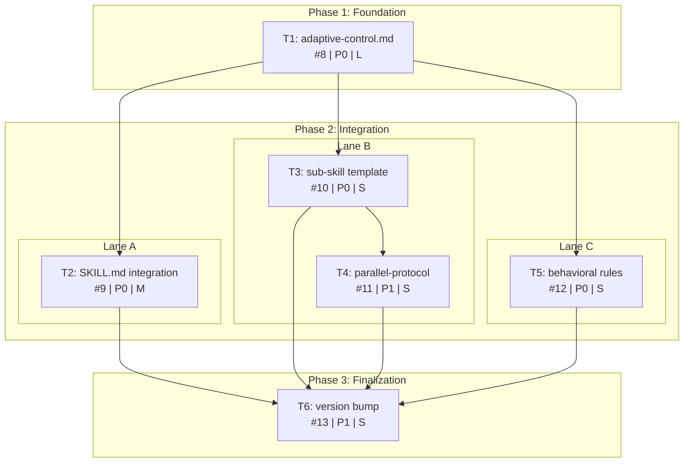

# Dependency Graph

```mermaid
graph TD
    subgraph "Phase 1: Foundation"
        T1["T1: adaptive-control.md<br/>#8 | P0 | L"]
    end

    subgraph "Phase 2: Integration"
        subgraph "Lane A"
            T2["T2: SKILL.md integration<br/>#9 | P0 | M"]
        end
        subgraph "Lane B"
            T3["T3: sub-skill template<br/>#10 | P0 | S"]
            T4["T4: parallel-protocol<br/>#11 | P1 | S"]
        end
        subgraph "Lane C"
            T5["T5: behavioral rules<br/>#12 | P0 | S"]
        end
    end

    subgraph "Phase 3: Finalization"
        T6["T6: version bump<br/>#13 | P1 | S"]
    end

    T1 --> T2
    T1 --> T3
    T1 --> T5
    T3 --> T4
    T2 --> T6
    T3 --> T6
    T4 --> T6
    T5 --> T6
```
