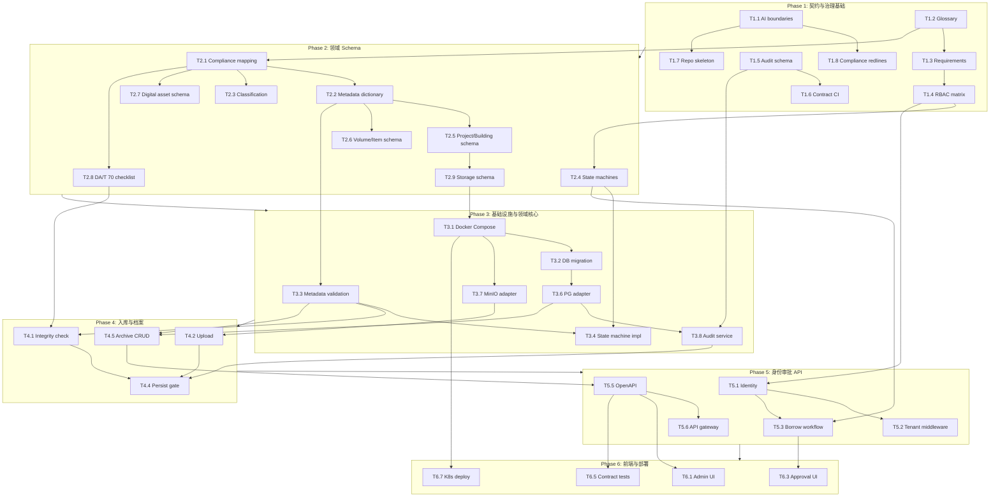

# Task Dependency Graph



## Parallel Execution Summary

| Phase | Lanes | Max Parallelism |
|:------|:------|:----------------|
| 1 | A, B, C | 3 agents |
| 2 | A, B, C | 3 agents |
| 3 | A, B, C | 3 agents |
| 4 | A, B, C | 3 agents |
| 5 | A, B, C | 3 agents |
| 6 | A, B, C | 3 agents |

## Critical Path

```
T1.2 → T2.1 → T2.2 → T3.3 → T4.1 → T4.4 → T5.5 → T6.1 → T6.8
```

契约层（Phase 1–2）在关键路径上 — **不可压缩**。
